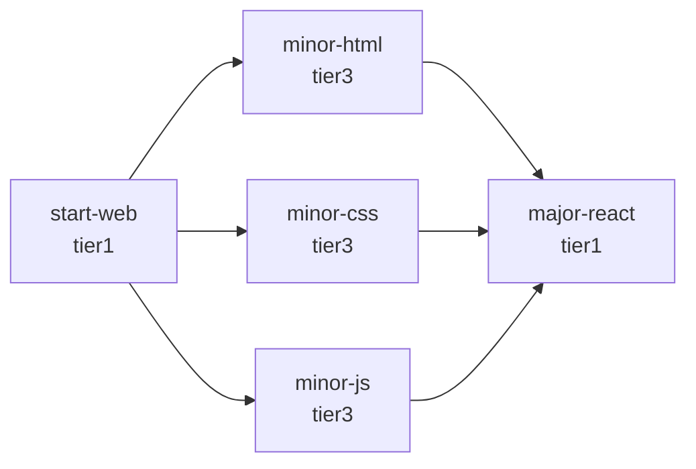
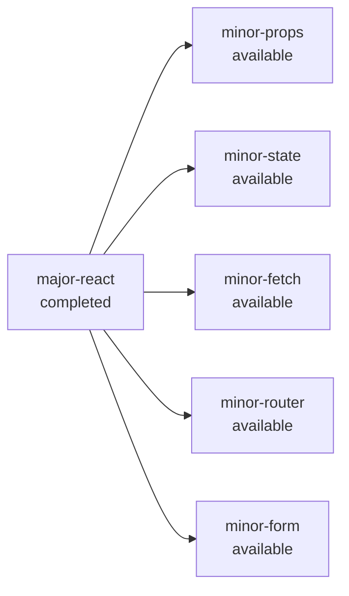
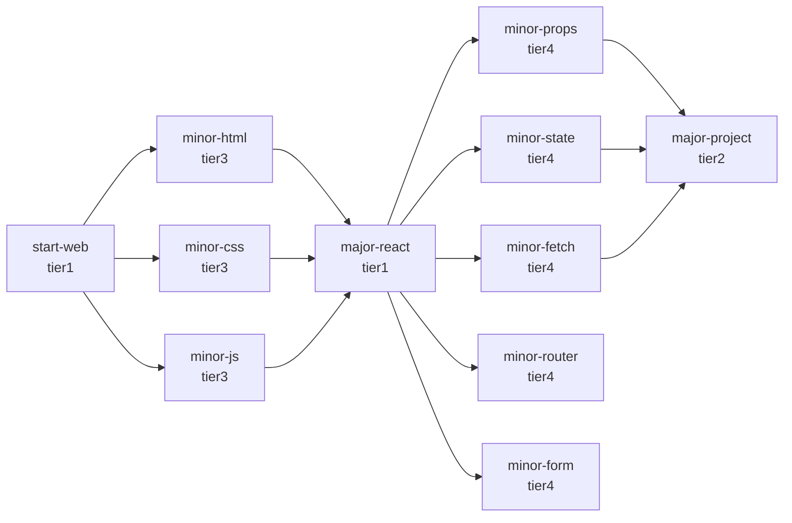
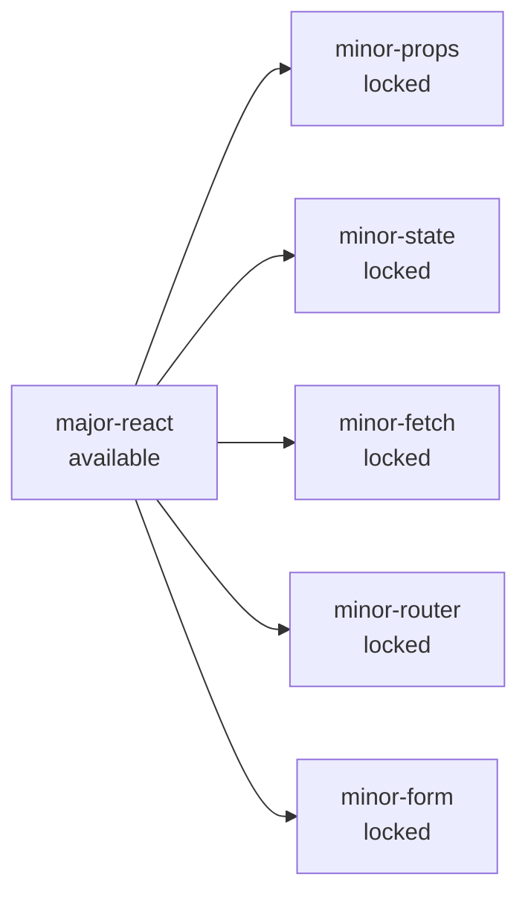
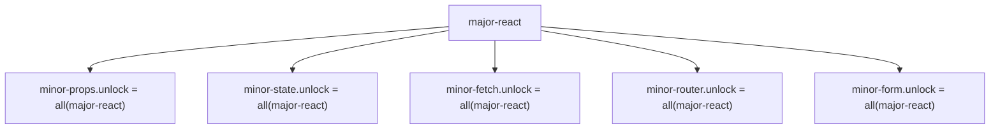

# SkillMap サンプル構造の図解（更新版）

このドキュメントは、現在のメモに出てきたサンプルデータを図にしたものです。  
今回は特に、**1つのノードが複数のノードを解放する状態の見た目**も追加しています。

対象の考え方:
- `start-web`
- `minor-html`
- `minor-css`
- `minor-js`
- `major-react`
- `major-react` 完了後に開く複数ノード
  - `minor-props`
  - `minor-state`
  - `minor-fetch`
  - `minor-router`
  - `minor-form`

---

## 1. 既存のサンプル構造



### 解放条件
```ts
major-react.unlock = {
  mode: 'any',
  nodeIds: ['minor-html', 'minor-css', 'minor-js']
}
```

### 意味
- `start-web` の先に HTML / CSS / JS の入口が並ぶ
- `major-react` はそのどれか 1 つ完了で開く
- 見た目は 3 本の線が `major-react` に集まる

---

## 2. 1つのノードが複数ノードを解放する見え方



### この図の意味
- `major-react` を完了すると
- その先の複数ノードが一気に `available` になる

これは「React を終えたことで、次の学習の選択肢が複数開く」見え方です。

---

## 3. 解放条件としての意味

各後続ノードは、たとえば以下のように `major-react` を前提として持ちます。

```ts
{
  id: 'minor-props',
  unlock: { mode: 'all', nodeIds: ['major-react'] }
}

{
  id: 'minor-state',
  unlock: { mode: 'all', nodeIds: ['major-react'] }
}

{
  id: 'minor-fetch',
  unlock: { mode: 'all', nodeIds: ['major-react'] }
}

{
  id: 'minor-router',
  unlock: { mode: 'all', nodeIds: ['major-react'] }
}

{
  id: 'minor-form',
  unlock: { mode: 'all', nodeIds: ['major-react'] }
}
```

つまり、
- `major-react` 側に「5個解放する」という設定があるわけではなく
- 各ノード側がそれぞれ `major-react` を前提条件として参照している

という構造です。

---

## 4. つなげて見るとこうなる



### 見え方としては
- 前半: 複数ノードから 1 ノードに集まる
- 後半: 1 ノードから複数ノードへ広がる
- さらにその一部のノード群から次のノードへ進める

つまり今の構造は、
**多対1 と 1対多 の両方を自然に表現できる**形です。

---

## 5. 状態変化込みで見る

### `major-react` 完了前


### `major-react` 完了後


### ここで確認したいこと
この見え方なら、

- 1つの大きな節目を超えたあとに
- 次の学習候補が一気に広がる

という感覚がかなり出ます。

---

## 6. データ構造としての理解



この図が表すこと:
- 実際には `major-react` が「子一覧」を持っているわけではない
- 後続ノードたちが `major-react` を前提として参照している
- 結果として見た目は「1ノードが複数ノードを解放する」ように見える

---

## 7. いまのイメージを言葉にすると

この構造は、たとえばこういう学習体験に向いています。

- `major-react` は 1 つの節目
- それを超えると
  - props
  - state
  - fetch
  - router
  - form
  のような複数の学習テーマが一気に開く
- ユーザーはその中から好きな順に進める

つまり、
**「1つの節目を達成したら、次の選択肢が複数広がる」**
という体験を素直に表現できます。

---

## 8. 今回の追加で確認したいポイント

この図で特に確認したいのは次の点です。

- `major-react` から複数ノードへ広がる見え方で合っているか
- 「1ノードが複数ノードを解放する」というイメージに近いか
- ただし内部構造としては、各後続ノード側の `unlock` 参照で成り立っている理解で違和感がないか

もしイメージとして
「React を終えると、その下に props / state / fetch などの学習候補がばっと開く」
なら、この図はかなり近いはずです。
